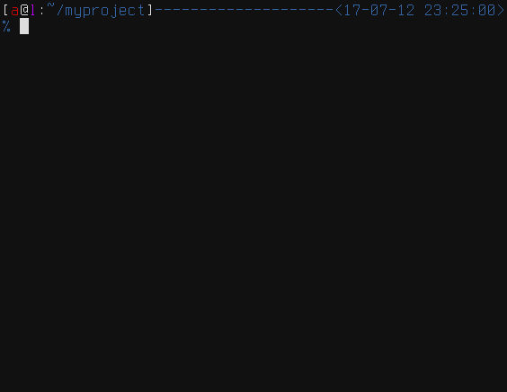

# Coa

The coding assistant.

Coa is a local CI tool which can be easily integrated
to any project to automatically act on code changes.
With Coa you can easily run automated code linters, build tools,
tests or any custom project related scripts when your code changes.




## How it works

Coa consists of two parts: a daemon and a command line interface for the daemon.
The daemon is responsible for running each project's configured commands and sending
notifications about the commands results.

Daemon can be started with the `coa listen` command.

See `coa --help` for detailed description of possible commands.


### Configuration

#### Global settings

Coa has a global settings file where project independent settings can be specified.
The location is `$XDG_CONFIG_HOME/coa/settings.yml` on Linux and `~/coa/settings.yml` on other platforms.
`-c/--config` switches can be used to load config from custom location.

Be sure `settings.yml` exists in the config directory, before you run Coa.


##### Example `settings.yml`

```yaml
notifiers:
  - type: shell
    args:
        fail_command: notify-send -u critical {{.Title}} {{.Message}}
        pass_command: notify-send -u normal {{.Title}} {{.Message}}
  - type: log
```

The above config uses two notifiers to handle project events. First is a shell notifier
which uses the `notify-send` Linux command to raise popup alert. Second is a simple
logger notification backend. Logging backend logs to STDERR if no `destination` argument is specified.


#### Project configuration

Every project managed by Coa requires a project configuration file describing what Coa should do on that project.
This file can be placed anywhere, but its directory will be the working directory of the project's commands.

Add new project to Coa by running `coa add [path_to_project_config.yml]`.


##### Example `.coa.yml` (project based config)

```yaml
name: searx
checkers:
    - name: Pep8
      paths: [searx/*py, searx/*/*py]
      command: ./manage.sh pep8_check

    - name: Babel
      paths: [searx/translations/*/LC_MESSAGES/*.po]
      command: ./env/bin/pybabel compile -d searx/translations
```


## Installation and usage

```
$ go get github.com/asciimoo/coa
$ "$GOPATH/bin/coa" --help
```

## Bugs

Bugs or suggestions? Visit the [issue tracker](https://github.com/asciimoo/coa/issues)
